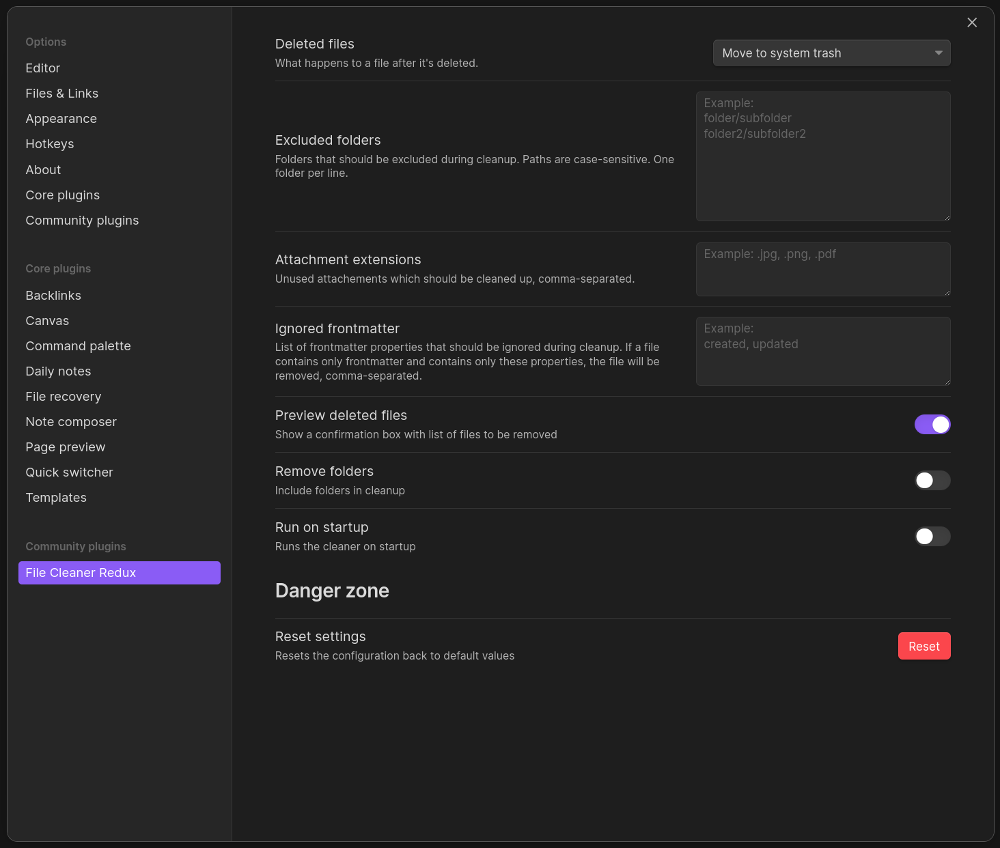
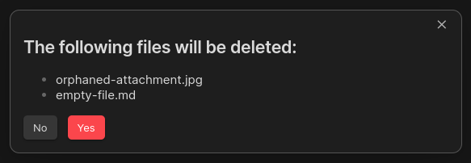
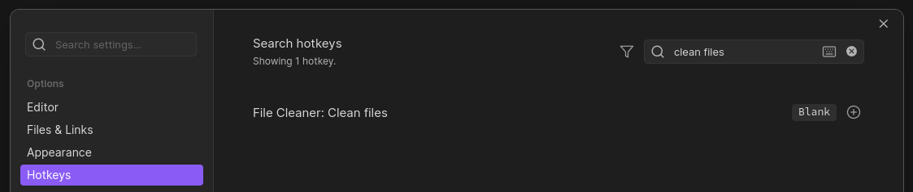

## File Cleaner Redux

File Cleaner Redux is a plugin for Obsidian (https://obsidian.md) to help remove unused / empty markdown files and attachments based on a few simple user-defined rules.

Based on https://github.com/Johnson0907/obsidian-file-cleaner

## What this plugin does

- Removes Markdown files with a size of 0 bytes (Optional) (See: [#88](https://github.com/husjon/obsidian-file-cleaner-redux/issues/88))
- Removes user-defined attachment files (e.g: jpg, jpeg, png, gif, svg, pdf)
- Support for cleaning empty files containing only specific frontmatter (Optional) (See: https://github.com/husjon/obsidian-file-cleaner-redux/issues/16)
- Removes empty folders recursively (Optional)
- Folder exclusion / inclusion (Optional)
- Set deletion location
  - Move to system trash
  - Move to Obsidian trash (.trash folder)
  - Permanently delete
- Preview of list of files and folders that will be removed (Optional)
- Run on Startup (Optional)
- Supports the following external plugins:
  - Admonition (as of v1.0.0 - [#57](https://github.com/husjon/obsidian-file-cleaner-redux/pull/57))
  - Excalidraw (as of v1.3.0)
    Note: This does require JSON compression in Excalidraw to be turned off.
    This can be done in Excalidraw Setting > Saving > Compress Excalidraw JSON in Markdown

### How to use the plugin

- Click the "File Cleaner" ribbon icon or add a Keybinding for the `Clean files` command.

### Screenshots

#### Plugins Settings (showing default values)

#### Preview of deleted files

#### Hotkeys

### Known issue

- ~~Attachments used in [Admonition](https://github.com/valentine195/obsidian-admonition) code blocks are not recognized~~
