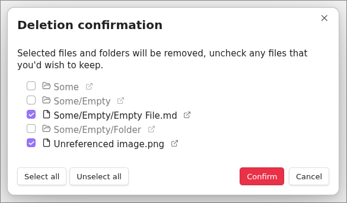

## File Cleaner

File Cleaner is a plugin for Obsidian (https://obsidian.md) to help remove unused / empty markdown files and attachments based on a few simple user-defined rules.

## What this plugin does

- Removes Markdown files with a size of 0 bytes.
- Removes user-defined attachment files (e.g: jpg, jpeg, png, gif, svg, pdf)
- Set deletion location
  - Move to system trash
  - Move to Obsidian trash (.trash folder)
  - Permanently delete
- Preview of list of files that will be removed (Optional)
- Run on Startup (Optional)

### How to use the plugin

- Click the "File Cleaner" ribbon icon or add a Keybinding for the `Clean files` command.

### Screenshots

#### Plugins Settings (showing default values)

#### Preview of deleted files

#### Hotkeys

### Known issue

- ~~Attachments used in [Admonition](https://github.com/valentine195/obsidian-admonition) code blocks are not recognized~~
