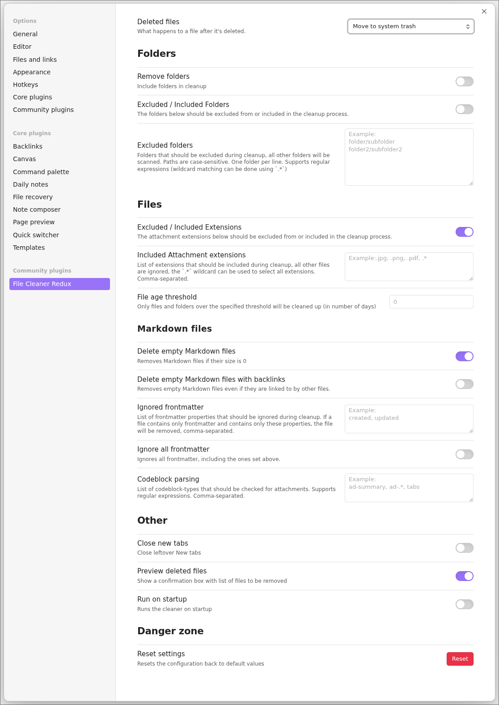
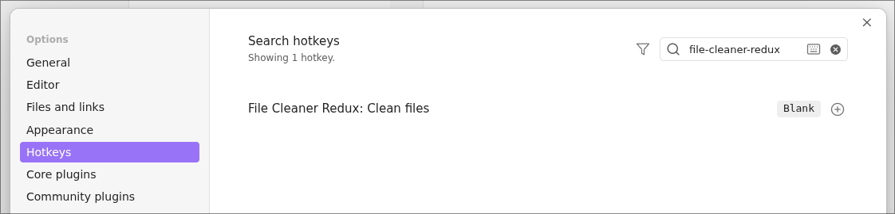

# File Cleaner Redux

File Cleaner Redux is a plugin for Obsidian (https://obsidian.md) which helps in removing unused / empty markdown files and attachments based on a few user controlled options.

Out of the box, this plugin only looks for completely empty markdown files which are not referenced to by other files.

When performing the cleanup, the user will be presented with a summary of which files was found and the user can then choose to delete all, none or some of these files (See [#Preview of deleted files](#preview-of-deleted-files)).

## Features

A short summary of features, more details can be found under [Options](#options)

- Removes Markdown files with a size of 0 bytes (Optional) (See: [#88](https://github.com/husjon/obsidian-file-cleaner-redux/issues/88))
- Removes user-defined attachment files (e.g: jpg, jpeg, png, gif, svg, pdf)
- Support for cleaning empty files containing only specific frontmatter (Optional) (See: https://github.com/husjon/obsidian-file-cleaner-redux/issues/16)
- Removes empty folders recursively (Optional)
- Folder exclusion / inclusion (Optional)
- Set deletion location
  - Move to system trash
  - Move to Obsidian trash (.trash folder)
  - Permanently delete
- Preview of list of files and folders that will be removed (Optional)
- Run on Startup (Optional)
- Supports the following external plugins:
  - Admonition (as of v1.0.0 - [#57](https://github.com/husjon/obsidian-file-cleaner-redux/pull/57))
  - Excalidraw (as of v1.3.0)
    Note: This does require JSON compression in Excalidraw to be turned off.
    This can be done in Excalidraw Setting > Saving > Compress Excalidraw JSON in Markdown

## Options

A [screenshot](#plugins-settings-showing-default-values) showing all the options can be found below.

### Folders

#### Remove folders (optional)

Can be toggled to allow for deletion of empty folders during the cleanup.

#### Excluded / Included Folders (Optional)

Toggles between using a list of excluded or included folders to look for files.
The same list is used for both exclusion/inclusion however they are mutually exclusive.  
If toggled off, the list is used for exclusion, meaning that the plugin will scan all folders **except** for the ones listed.  
If toggled on, the list is used for inclusion, meaning that the plugin will **only** scan the listed folders.

### Files

#### Excluded / Included Extensions (Optional)

Toggles between using a list of excluded or included extensions to look for.
The same list is used for both exclusion/inclusion however they are mutually exclusive.  
If toggled off, the list is used for exclusion, meaning that the plugin will **ignore** any attachments with extensions listed here.  
If toggled on, the list is used for inclusion, meaning that the plugin **will only** look for attachments with extensions listed here.

#### Markdown files

##### Delete empty Markdown files (Optional)

Deletes any markdown files that are empty and have **no** references.

##### Delete empty Markdown files with backlinks (Optional)

If [Delete empty Markdown files](#delete-empty-markdown-files-optional) is enabled, one can also choose to allow for deleting empty markdown files even if they have links to them.

Example usage is when having links to files that will be made in the future but is not ready to be started on.

##### Ignored frontmatter

A list of frontmatter properties which will be ignored during cleanup.
If a markdown file only contains markdown and only contains these properties, it will be considered empty and added to the list of files to be removed.

##### Ignore all frontmatter (Optional)

Ignores all frontmatter during cleanup, even the ones listed above.

##### Codeblock parsing

A list of codeblock-types that should be checked for attachments.
This option does only look for attachment links that follow the style of Markdown or Wikilink

Valid attachment links:

- Markdown
  ```md
  [Link label](path/to/file.md)
  
  ```
- Wikilink

  ```md
  [[Path to file]] # file link
  [[Path to file|Label]] # file link with label override
  ```

- Wikilink (image)
  ```md
  ![[Link to image]] # image with or without size
  ![[Link to image|200]] # image with or without size
  ```

### Other

#### Close new tabs (Optional)

Close leftover New tabs

#### Preview deleted files (Optional)

Shows a confirmation box with list of files and folders to be removed (see [screenshot](#preview-of-deleted-files)).

#### Run on startup (Optional)

Runs the cleaner on startup

### External Plugin Support

Only visible if any of the supported plugins are enabled, currently only Excalidraw

#### Excalidraw

##### Treat Excalidraw files as attachments

With this option enabled any Excalidraw that are no longer referenced by other files, will be removed.

## How to use the plugin

- Click the "File Cleaner" ribbon icon or add a Keybinding for the `Clean files` command.

## Screenshots

### Plugins Settings (showing default values)



### Preview of deleted files


### Hotkeys



## Known issue

- ~~Attachments used in [Admonition](https://github.com/valentine195/obsidian-admonition) code blocks are not recognized~~

## Inspiration and credits

Originally based on https://github.com/Johnson0907/obsidian-file-cleaner
